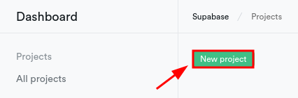
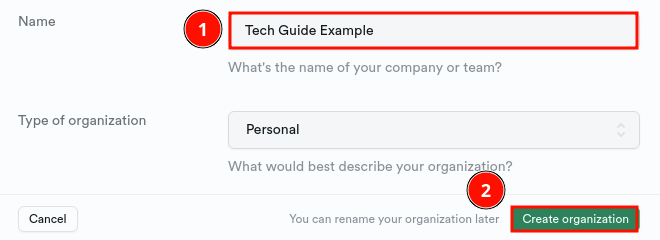
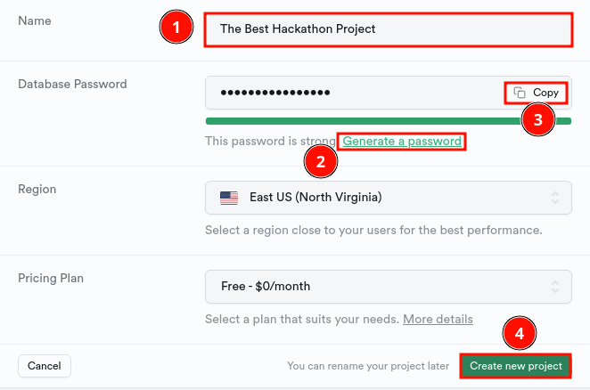
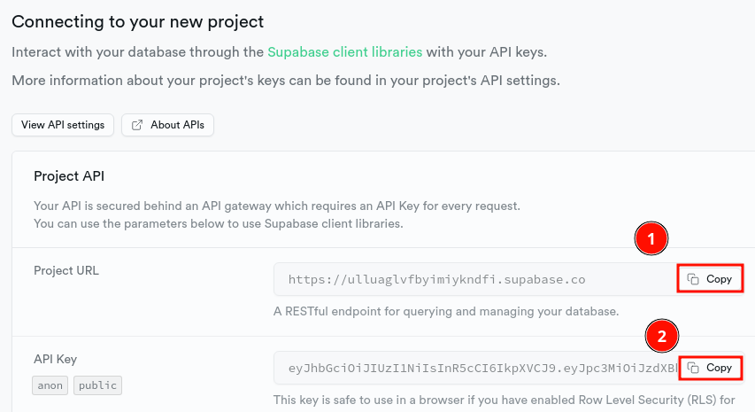
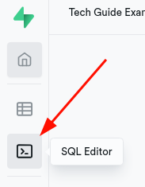

# Supabase Tech Guide

---

Looking to hook your app up with a DB? Tired of Firebase?

## Table of Contents

1. [Supabase setup](#supabase-setup)
2. [Creating models](#creating-your-models)
3. [Coding up the client and queries](#coding-up-a-db-client)
  - [Simple query exampels](#query-examples)
  - [More complex query exampels](#query-examples)

4. [Misc](#misc-ignore-unless-applicable)

## Supabase Setup

1. Create a [Supabase account](https://app.supabase.com/sign-up).
2. Create a new project.

   

3. You'll be asked to create a new org.

   

4. Name the project and generate a password.

   

5. Scroll down and copy the project URL and API key. Save these somewhere for later.



## Creating Your Models

Head over to the SQL Editor as shown below:



To represent our users, let's start by creating a `profile` table.

<small>Supabase reserves the table `auth.user`, so we'll call ours `profile` to avoid confusion.</small>

```SQL
create table profile (
  id bigint generated by default as identity primary key,
  username varchar(255) not null,
  email varchar(320) unique
);
```

For demonstration purposes, our users will have friends:

```SQL
create table friends (
  profile1_id bigint not null references profile on delete cascade,
  profile2_id bigint not null references profile on delete cascade,
  primary key (profile1_id, profile2_id)
);
```

and posts:

```SQL
create table posts (
  id bigint generated by default as identity primary key,
  title varchar(255) not null,
  description varchar(500),
profile_id bigint not null references profile on delete cascade,
  likes integer default 0
);
```

In order to rerun our script multiple times during development, we'll need to drop the existing tables. It's also important that we drop tables in order of dependence (i.e. `profile` is dropped last because everything depends on it). Add this to the top:

```SQL
drop table if exists posts;
drop table if exists friends;
drop table if exists profile;
```

### Coding Up a DB CLient and Queries

> **Note**: Don't close out of your SQL editor, we'll need it later :)

#### Client Installation

Install the supabase JS client.

```bash
npm i --save @supabase/supabase-js
```

**IF** your project does **NOT** come out of the box with `.env` support, install the following:

```bash
npm i --save dotenv
```

[How do I know my project comes out of the box with `.env` support?](#how-do-i-know-if-my-project-has-env-support)

#### Env Setup

Create a `.env` file in the root directory of your project.

```.env
PUBLIC_SUPABASE_URL=https://abc123.supabase.co
PUBLIC_SUPABASE_KEY=abc123
```

Create an `env.js` file somewhere in your project. From here, we'll export our two environment variables.

```JS
export const supabaseURL = process.env.PUBLIC_SUPABASE_URL;
export const supabaseKey = process.env.PUBLIC_SUPABASE_KEY;
// If you're using CommonJS:
// module.exports = {
//   supabaseURL: process.env.PUBLIC_SUPABASE_URL,
//   supabaseKey: process.env.PUBLIC_SUPABASE_KEY
// }
```

> **Note**: **IF** you install `dotenv`, you need to add this to the top of the file:
>
> ```JS
> require("dotenv").config()
> ```
>
> or, if you're writing an ESM module:
>
> ```JS
> import { config } from "dotenv";
> config();
> ```

#### Client Initialization

Create a file called `client.js`. To initialize the client:

```JS
import { createClient } from "@supabase/supabase-js";
import { supabaseKey, supabaseURL } from "path/to/env.js";
// If you're using CommonJS:
// const { createClient } = require("@supabase/supabase-js")
// const { supabaseKey, supabaseURL } = require("path/to/env.js")

export const supabase = createClient(supabaseURL, supabaseKey);
```

You can now import `supabase`. Below will be project agnostic examples.

#### Query Examples

Simple, project agnostic queries. If you skipped to here, see: [Supabase project initialization](https://supabase.com/docs/reference/javascript/initializing).

#### More Complex Queries

Complex, project agnostic queries. If you skipped to here, see: [Supabase project initialization](https://supabase.com/docs/reference/javascript/initializing).

Adding RPC calls for non-supported SDK functions. TODO(akevinge).

A query to select the top 10 most liked posts among a user's friends:

```JS
// postFeed fetches top X most liked posts among a user's friends.
// This iterates over the return values instead of using an SQL efficient query;
// See: https://github.com/supabase/postgrest-js/issues/198
export async function postFeed(userId, limit = 10) {
  return supabase
    .from("friends")
    .select(
      `
    profile2_id (
        id,
        username,
        posts ( title, description, likes )
      )
    `
    )
    .or(`profile1_id.eq.${userId}`)
    .throwOnError()
    .then(({ data }) => {
      return data
        // [[user, posts]] -> [posts]
        .flatMap(({ profile2_id }) => profile2_id["posts"])
        .sort((a, b) => (a.likes < b.likes ? 1 : -1)) // Sort by likes (ascending).
        .slice(0, limit);
    });
}
```

### Misc (Ignore unless applicable)

#### How do I know if my project has `.env` support?

- Did you use any web frameworks/boilerplates? Then it probably does.
- Did you use Create React App? [Click here](https://create-react-app.dev/docs/adding-custom-environment-variables/#adding-development-environment-variables-in-env)
- Did you use Next.js? [See here](https://nextjs.org/docs/pages/building-your-application/configuring/environment-variables)
- Are you running an barebones Node.js app (e.g. Express, Fastiy, or nothing at all)? Then probably not.
